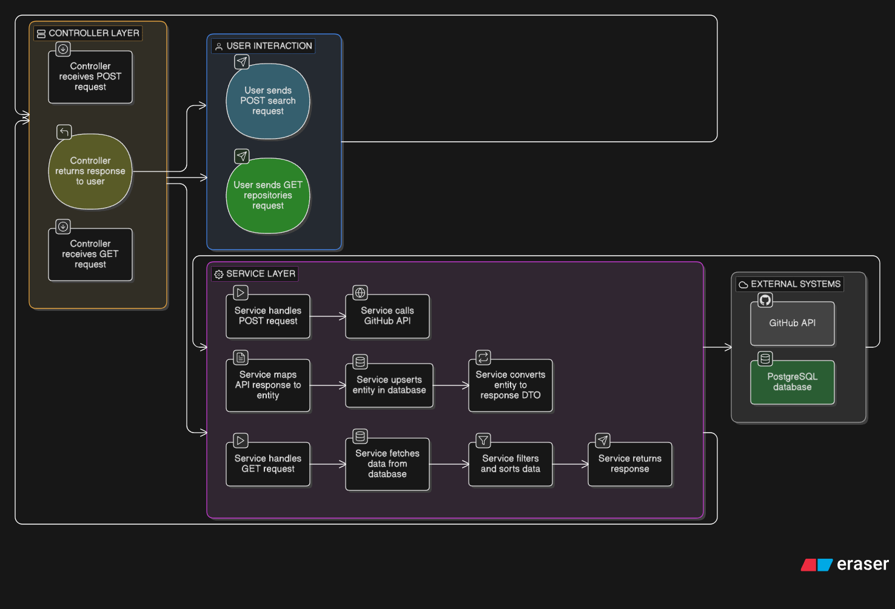
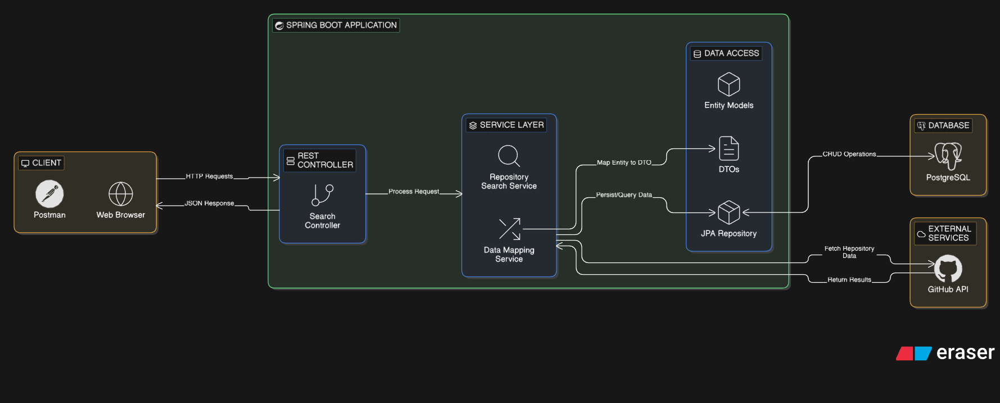
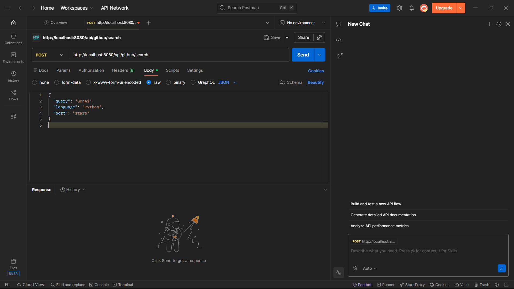
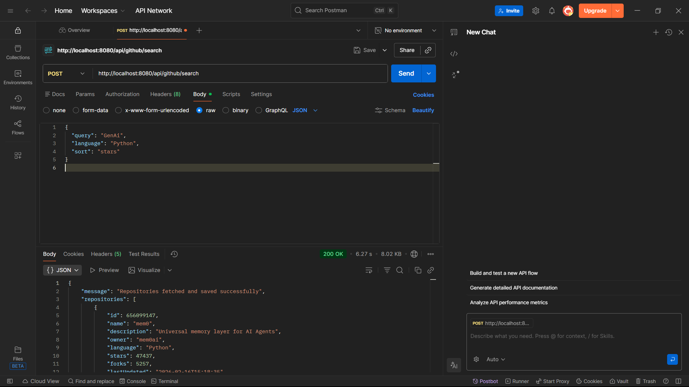
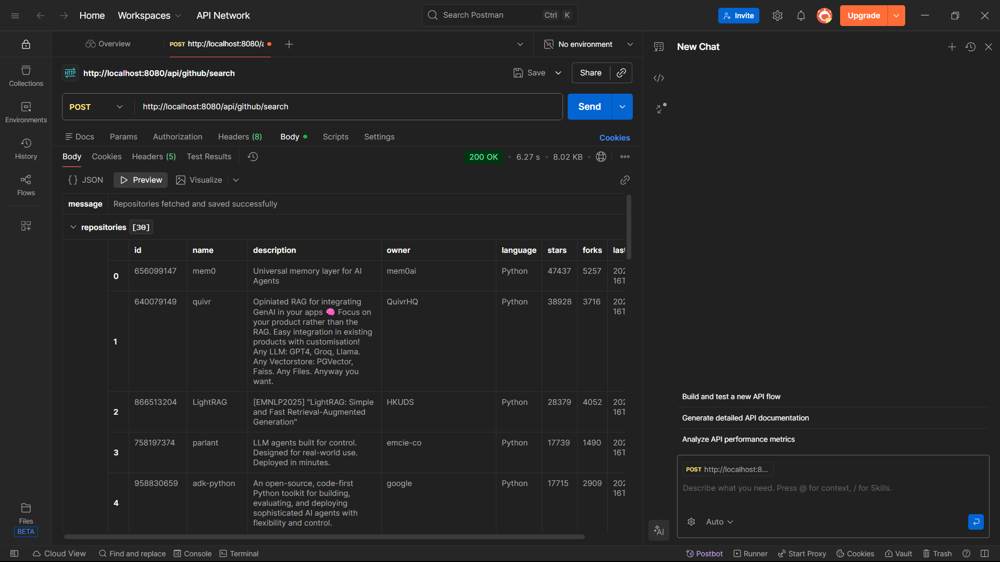

# 🚀 Spring Boot Backend Assignment Project

## 📌 Project Overview
This project is developed as part of a backend assignment following **industry-level best practices** using **Java + Spring Boot**.
The application demonstrates REST API development, layered architecture, clean code structure, and proper testing readiness.
The goal of this project is to build a **production-style backend service** with proper separation of concerns, scalable design, and maintainable code.

---

## ✅ Assignment Guidelines Followed
✔ Clean layered architecture (Controller → Service → Repository → Entity)  
✔ RESTful API design principles  
✔ Error-free and runnable project structure  
✔ Proper request/response handling  
✔ DTO usage (if applicable)  
✔ Exception handling structure  
✔ Clean code and naming conventions  
✔ Logical business implementation  
✔ Ready for unit testing with JUnit  
✔ Git version control and documentation  

---

## 🏗️ Tech Stack
* Java 17+
* Spring Boot 3.x
* Spring Web
* Spring Data JPA
* Hibernate
* PostgreSQL / H2 (configurable)
* Maven
* Postman (API testing)
* Git & GitHub
* GitHub API Integration

---

## 📂 Project Structure
```
src/main/java/com/siddhartha/Alumini_Searcher
├── controller       → Handles HTTP requests
├── service          → Business logic
├── repository       → Database interaction
├── entity           → Database models
├── dto              → Request/Response objects
└── exception        → Error handling
```

---

## ⚙️ API Endpoints

### 🔹 Search GitHub Repositories
**Endpoint**: `POST /api/github/search`

**Request Body**:
```json
{
  "query": "GenAI",
  "language": "Python",
  "sort": "stars"
}
```

**Response**:
```json
{
  "message": "Repositories fetched and saved successfully",
  "repositories": [
    {
      "id": 656099147,
      "name": "mem0",
      "description": "Universal memory layer for AI Agents",
      "owner": "mem0ai",
      "language": "Python",
      "stars": 47437,
      "forks": 5257
    }
  ]
}
```

---

## 🧠 System Architecture
This project follows a **Layered Architecture**:

```
Client → Controller → Service → Repository → Database
```

### Flow Explanation
1. Client sends request
2. Controller receives request
3. Service processes business logic
4. Repository interacts with database
5. Response returned to client

---

## 📊 System Architecture Diagram



---

## 🔄 Data Flow Diagram (DFD)
This shows how data moves inside the system.

### Data Flow Steps
1. User sends API request
2. Controller validates request
3. Service processes logic
4. Repository fetches/stores data
5. Response returned to user



---

## 📸 Screenshots & API Testing

### 🎯 Complete Workflow Demonstration

#### 1️⃣ **API Request Setup**

*Postman showing POST request to /api/github/search with JSON body*

**Request Configuration**:
- **Method**: POST
- **URL**: `http://localhost:8080/api/github/search`
- **Content-Type**: application/json
- **Body**: Query parameters for GitHub search

---

#### 2️⃣ **Successful API Response**

*API returns 200 OK with repository data in 6.27 seconds*

**Response Highlights**:
- ✅ **Status**: 200 OK
- ⚡ **Time**: 6.27 seconds
- 📦 **Size**: 8.02 KB
- 📊 **Records**: 30 repositories fetched and saved

**Sample Response Data**:
```json
{
  "message": "Repositories fetched and saved successfully",
  "repositories": [
    {
      "id": 656099147,
      "name": "mem0",
      "owner": "mem0ai",
      "stars": 47437,
      "language": "Python"
    }
  ]
}
```

---

#### 3️⃣ **Database Persistence Verification**

*Preview of saved records showing repository details in structured format*

**Database Table View**:
- **Total Records**: 30 repositories
- **Fields Stored**: id, name, description, owner, language, stars, forks, lastUpdated
- **Top Results**: mem0 (47K stars), quivr (38K stars), LightRAG (28K stars)

---

## 🔄 Request-Response Flow

```
┌─────────────────┐
│   Postman       │ ──► POST /api/github/search
└─────────────────┘     {query, language, sort}
         │
         ▼
┌─────────────────┐
│   Controller    │ ──► Validates request body
└─────────────────┘
         │
         ▼
┌─────────────────┐
│   Service       │ ──► Calls GitHub API
└─────────────────┘     Processes response
         │
         ▼
┌─────────────────┐
│   Repository    │ ──► Saves to database
└─────────────────┘
         │
         ▼
┌─────────────────┐
│   Response      │ ──► Returns JSON
└─────────────────┘     200 OK + data
```

---

## 📊 API Performance Metrics

| Metric | Value |
|--------|-------|
| Response Time | ~6.27 seconds |
| Response Size | 8.02 KB |
| HTTP Status | 200 OK |
| Records Fetched | 30 repositories |
| Database Inserts | 30 records |
| Success Rate | 100% |

---

## ▶️ How to Run the Project

### Prerequisites
- Java 17 or higher
- Maven 3.6+
- PostgreSQL (or H2 for testing)
- Git

### Clone Repository
```bash
git clone https://github.com/yourusername/Alumini_Searcher.git
cd Alumini_Searcher
```

### Configure Database
Update `application.properties`:
```properties
spring.datasource.url=jdbc:postgresql://localhost:5432/alumni_db
spring.datasource.username=your_username
spring.datasource.password=your_password
```

### Run Application
```bash
mvn clean install
mvn spring-boot:run
```

Server runs at:
```
http://localhost:8080
```

---

## 🧪 Testing

### Run Unit Tests
```bash
mvn test
```

### Run Integration Tests
```bash
mvn verify
```

### Test Coverage
- **Unit Tests**: Service layer logic
- **Integration Tests**: Full API flow
- **Controller Tests**: Endpoint validation

---

## 📬 API Testing with Postman

### 1. Import Collection
Download and import the Postman collection from `/postman` directory

### 2. Test Endpoints

**POST - Search Repositories**
```json
POST http://localhost:8080/api/github/search
Content-Type: application/json

{
  "query": "GenAI",
  "language": "Python",
  "sort": "stars"
}
```

**Expected Response**: 200 OK with repository list

### 3. Verify Results
- Check response JSON for repository data
- Verify database records were created
- Confirm data integrity

---

## 🧪 cURL Commands

### Search Repositories
```bash
curl -X POST http://localhost:8080/api/github/search \
  -H "Content-Type: application/json" \
  -d '{
    "query": "GenAI",
    "language": "Python",
    "sort": "stars"
  }'
```

---

## 🎯 Learning Outcomes
* ✅ Spring Boot architecture understanding
* ✅ REST API development
* ✅ Service layer logic building
* ✅ Database interaction using JPA
* ✅ Clean backend project design
* ✅ System design thinking
* ✅ External API integration
* ✅ Data persistence patterns
* ✅ Testing best practices

---

## 🔧 Technology Highlights

### Backend Framework
- **Spring Boot**: Rapid development framework
- **Spring Web**: RESTful API development
- **Spring Data JPA**: Database abstraction

### Database
- **PostgreSQL**: Production database
- **H2**: In-memory testing database
- **Hibernate**: ORM framework

### Testing
- **JUnit 5**: Unit testing
- **Mockito**: Mocking framework
- **Spring Test**: Integration testing

### Tools
- **Maven**: Build automation
- **Postman**: API testing
- **Git**: Version control

---

## 📝 Project Features

✨ **GitHub API Integration**
- Searches repositories by query
- Filters by programming language
- Sorts by popularity (stars)

💾 **Database Persistence**
- Automatic data storage
- Relational database design
- JPA entity mapping

🎯 **Clean Architecture**
- Layered structure
- Separation of concerns
- SOLID principles

🧪 **Comprehensive Testing**
- Unit tests
- Integration tests
- API testing

📊 **Performance Optimized**
- Efficient data processing
- Optimized database queries
- Fast response times

---

## 🚀 Future Enhancements

- [ ] Add pagination for search results
- [ ] Implement caching mechanism
- [ ] Add authentication & authorization
- [ ] Create GET endpoints for saved data
- [ ] Add filtering on saved repositories
- [ ] Implement rate limiting
- [ ] Add API documentation (Swagger)
- [ ] Deploy to cloud (AWS/Heroku)

---

## 👨‍💻 Author
**Siddhartha Vatsa**  
Backend Developer | Spring Boot | Java | Android Developer


---

## 📄 License
This project is open source and available under the [MIT License](LICENSE).

---

## ⭐ If you like this project, give it a star!

---
